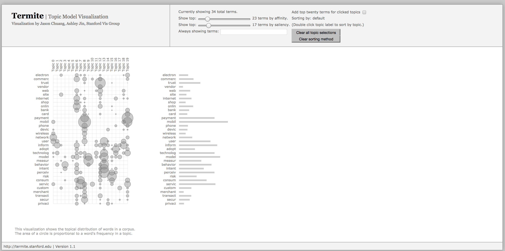

# Termite

This is a forked project of Termite by Chuang et al [1].

Termite is a visualization tool for inspecting the output of statistical topic models such as LDA. Provided a corpus `.csv` file, it generates an interactive interface to inspect topics.

Starting in 2014, the project [was moved to a separate Github project](https://github.com/uwdata/termite-data-server), split into two components, and unfortunately abandoned.

This forked former version of Termite, which does not rely on a database, provides a simpler input for data to be analyzed and displayed.

## Why this fork?

Currently, there are some dependencies "hiccups" when running Termite out of the box, and this fork seeks to minimally document workarounds to get it running.

A long term goal of this project is to decouple termite visualization from the termite data pipeline, by deferring the required input to a topic-term matrix and a document-topic matrix instead of the raw corpus. In doing so, other implementations of LDA and Topic Modelling, in general, can leverage the interface provided by Termite. A great example of this decoupling is [LDAVis](https://github.com/cpsievert/LDAvis), an r package visualization serving the same purpose and inspired by Termite.

## Usage

[README.old](https://github.com/sailuh/termite/blob/master/README.old) provides a great picture of how Termite was intended to execute when development was active.

To install Termite, from the main directory, execute:

`./setup.py`

Termite will fetch a number of libraries it has as dependencies to your computer.

 * While installing the required dependencies, `setup.py`  will first throw an error stating it can't move the file `compiler-latest.zip`. Inspecting the .zip file manually, you will find a jar file containing the expected file, however with a different name convention: `name+version`. Simple extract the closure<version>.jar file, and rename it to `closure.jar` inside the `lib` folder. Re-running the script will then rename it to the intended name, and finish installing.

 Once the installation is concluded, **README.old** will recommend running one of its examples. However, the example corpus can no longer be downloaded. To explicitly overwrite the necessary parts to run the configuration file, directly using `execute.py` with explicit parameters can launch the visualization. Specifically:

`./execute.py --corpus-path <corpus_file> example_lda.cfg --model-path <any_path_for_model> --data-path <any_path_for_output>`

 * `--corpus-path` Specifies the corpus single file of interest. finance_corpus.txt, hosted in our Github project, is an example corpus [originally found on Termite creator's Github](https://github.com/YingHsuan/termite_data_server/blob/master/apps/mobile_payment_mallet/data/corpus.txt) that can be used for a test-run.
   * In general, any corpus format is `doc-id\ttext`,i.e. a string of characters representing the id of a given document, tab, and the content. No spaces between the doc-id, tab and the first character of the document is allowed. The rest of the document can, in theory, contain any characters, but due to errors in formatting, it is recommended tokenization occurs over the raw corpus and then formatted to comply to the input format `doc-id\ttext`. The file should therefore contain as portion of the "text" a sequence of tokens, as it was done in the example **finance_corpus.txt**.
 * `--model-path` Is any path the user wants to store the topic model outputs generated by the topic model pipeline.
 * `--data-path` Is any path to save Termite-internal working files.

Termite will then create the necessary folders or overwrite the necessary folder and files in the specified path. Beware, this process can take from 5 to 30 minutes in a 2016 Macbook-Pro.

Finally, to open the visualization in your own computer, as instructed by **README.old**:

 1. Change into output directory (specified in the configuration file)

`cd <any_path_for_output>/public_html`

 2. Start a local server using python

`./web.sh`

 3. Open http://localhost:8888 in a modern web browser (Chrome, Safari, Firefox, or Opera)
      to view a visualization of the model outputs.

Or, to publish the results on a webserver:
 1. Copy public_html directory to your remote server.

## References

  [1] [Termite: Visualization Techniques for Assessing Textual Topic Models. Jason Chuang, Christopher D. Manning, Jeffrey Heer. Computer Science Dept, Stanford University.](http://vis.stanford.edu/papers/termite)
